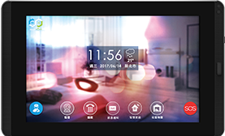
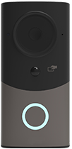
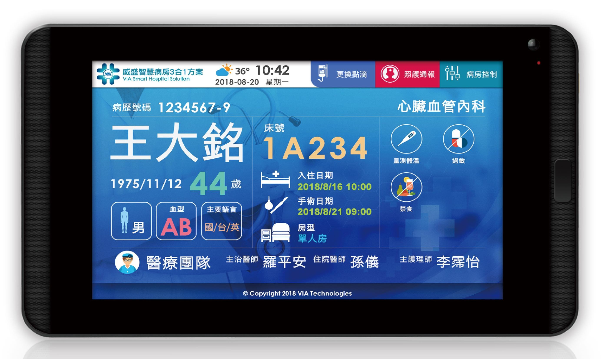

 SmartHome - WorldConnect

Android,C/C++ on RTOS.

---

 Website HomePage - Corner-stone

WordPress, CSS, PHP and HTML.

---

 SmartHospital - Bedside Information 

Android, light Sensor by Camera

---
